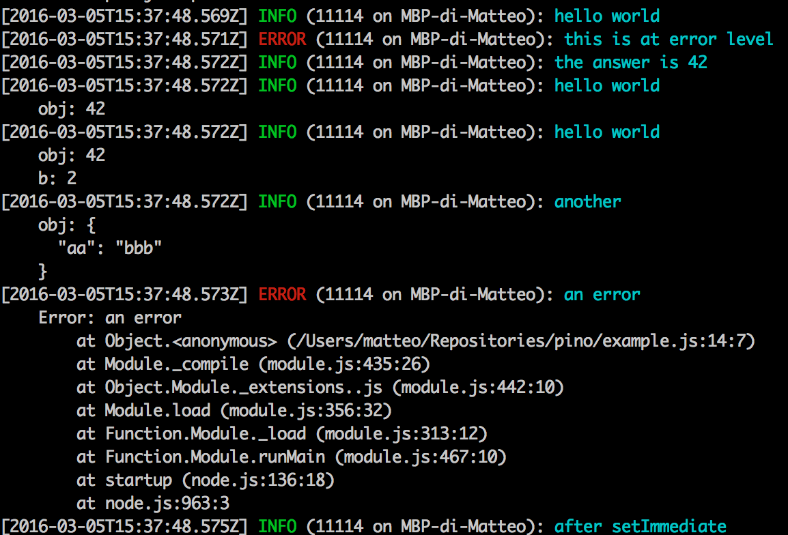

# pino&nbsp;&nbsp;[](https://travis-ci.org/pinojs/pino)&nbsp;[](https://coveralls.io/github/pinojs/pino?branch=master) [](http://definitelytyped.org)

[Extremely fast](#benchmarks) node.js logger, inspired by Bunyan.
It also includes a shell utility to pretty-print its log files.



* [Installation](#install)
* [Usage](#usage)
* [Benchmarks](#benchmarks)
* [API](#api)
* [Extreme mode explained](#extreme)
* [How to use Pino with Express](#express)
* [How to use Pino with Hapi](#hapi)
* [How to use Pino with Restify](#restify)
* [How to use Pino with Koa](#koa)
* [How do I rotate log files?](#rotate)
* [How do I redact sensitive information?](#redact)
* [How to use Transports with Pino](#transports)
* [Pino in the browser](#browser)
* [Caveats](#caveats)
* [Team](#team)
* [Acknowledgements](#acknowledgements)
* [License](#license)

## Install

```
npm install pino --save
```

## Usage

```js
'use strict'

var pino = require('pino')()

pino.info('hello world')
pino.error('this is at error level')
pino.info('the answer is %d', 42)
pino.info({ obj: 42 }, 'hello world')
pino.info({ obj: 42, b: 2 }, 'hello world')
pino.info({ obj: { aa: 'bbb' } }, 'another')
setImmediate(function () {
  pino.info('after setImmediate')
})
pino.error(new Error('an error'))

var child = pino.child({ a: 'property' })
child.info('hello child!')

var childsChild = child.child({ another: 'property' })
childsChild.info('hello baby..')

```

This produces:

```
{"pid":94473,"hostname":"MacBook-Pro-3.home","level":30,"msg":"hello world","time":1459529098958,"v":1}
{"pid":94473,"hostname":"MacBook-Pro-3.home","level":50,"msg":"this is at error level","time":1459529098959,"v":1}
{"pid":94473,"hostname":"MacBook-Pro-3.home","level":30,"msg":"the answer is 42","time":1459529098960,"v":1}
{"pid":94473,"hostname":"MacBook-Pro-3.home","level":30,"msg":"hello world","time":1459529098960,"obj":42,"v":1}
{"pid":94473,"hostname":"MacBook-Pro-3.home","level":30,"msg":"hello world","time":1459529098960,"obj":42,"b":2,"v":1}
{"pid":94473,"hostname":"MacBook-Pro-3.home","level":30,"msg":"another","time":1459529098960,"obj":{"aa":"bbb"},"v":1}
{"pid":94473,"hostname":"MacBook-Pro-3.home","level":50,"msg":"an error","time":1459529098961,"type":"Error","stack":"Error: an error\n    at Object.<anonymous> (/Users/davidclements/z/nearForm/pino/example.js:14:12)\n    at Module._compile (module.js:435:26)\n    at Object.Module._extensions..js (module.js:442:10)\n    at Module.load (module.js:356:32)\n    at Function.Module._load (module.js:311:12)\n    at Function.Module.runMain (module.js:467:10)\n    at startup (node.js:136:18)\n    at node.js:963:3","v":1}
{"pid":94473,"hostname":"MacBook-Pro-3.home","level":30,"msg":"hello child!","time":1459529098962,"a":"property","v":1}
{"pid":94473,"hostname":"MacBook-Pro-3.home","level":30,"msg":"hello baby..","time":1459529098962,"another":"property","a":"property","v":1}
{"pid":94473,"hostname":"MacBook-Pro-3.home","level":30,"msg":"after setImmediate","time":1459529098963,"v":1}

```

<a name="benchmarks"></a>
## Benchmarks

As far as we know, it is one of the fastest loggers in town:

`pino.info('hello world')`:

```
benchBunyan*10000: 1355.229ms
benchWinston*10000: 2226.117ms
benchBole*10000: 291.727ms
benchDebug*10000: 445.291ms
benchLogLevel*10000: 322.181ms
benchPino*10000: 269.109ms
benchPinoExreme*10000: 102.239ms
```

`pino.info({'hello': 'world'})`:

```
benchBunyanObj*10000: 1464.568ms
benchWinstonObj*10000: 2177.602ms
benchBoleObj*10000: 322.105ms
benchLogLevelObject*10000: 1443.148ms
benchPinoObj*10000: 309.564ms
benchPinoUnsafeObj*10000: 301.308ms
benchPinoExtremeObj*10000: 130.343ms
benchPinoUnsafeExtremeObj*10000: 131.322ms
```

`pino.info(aBigDeeplyNestedObject)`:

```
benchBunyanDeepObj*10000: 8749.174ms
benchWinstonDeepObj*10000: 17761.409ms
benchBoleDeepObj*10000: 5252.563ms
benchLogLevelDeepObj*10000: 43518.525ms
benchPinoDeepObj*10000: 5124.361ms
benchPinoUnsafeDeepObj*10000: 3539.253ms
benchPinoExtremeDeepObj*10000: 5138.457ms
benchPinoUnsafeExtremeDeepObj*10000: 3480.270ms
```

`pino.info('hello %s %j %d', 'world', {obj: true}, 4, {another: 'obj'})`:

```
benchDebugInterpolateExtra*10000: 640.001ms
benchBunyanInterpolateExtra*10000: 2888.825ms
benchWinstonInterpolateExtra*10000: 2616.285ms
benchBoleInterpolateExtra*10000: 1313.470ms
benchLogLevelInterpolateExtra*10000: 1487.610ms
benchPinoInterpolateExtra*10000: 486.367ms
benchPinoUnsafeInterpolateExtra*10000: 457.778ms
benchPinoExtremeInterpolateExtra*10000: 314.635ms
benchPinoUnsafeExtremeInterpolateExtra*10000: 294.915ms
```

In many cases, pino is over 6x faster than alternatives.

For a fair comparison, [LogLevel](http://npm.im/loglevel) was extended
to include a timestamp and [bole](http://npm.im/bole) had
`fastTime` mode switched on.

<a name="cli"></a>
## CLI

To use the command line tool, we can install `pino` globally:

```sh
npm install -g pino
```

Then we simply pipe a log file through `pino`:

```sh
cat log | pino
```

There are also two transformer flags..

 `-t` that converts Epoch timestamps to ISO timestamps.

```sh
cat log | pino -t
```
 and `-l` that flips the time and level on the standard output.

```sh
cat log | pino -l
```

`pino -t` will transform this:

```js
{"pid":14139,"hostname":"MacBook-Pro-3.home","level":30,"msg":"hello world","time":1457537229339,"v":0}
```

Into this:

```js
{"pid":14139,"hostname":"MacBook-Pro-3.home","level":30,"msg":"hello world","time":"2016-03-09T15:27:09.339Z","v":0}
```


`pino -l` will transform this:

```sh
[2016-03-09T15:27:09.339Z] INFO (14139 on MacBook-Pro-3.home): hello world
```

Into this:

```sh
INFO [2016-03-09T15:27:09.339Z] (14139 on MacBook-Pro-3.home): hello world
```

<a name="api"></a>
## API

  * <a href="#constructor"><code><b>pino()</b></code></a>
  * <a href="#child"><code>logger.<b>child()</b></code></a>
  * <a href="#level"><code>logger.<b>level</b></code></a>
  * <a href="#fatal"><code>logger.<b>fatal()</b></code></a>
  * <a href="#error"><code>logger.<b>error()</b></code></a>
  * <a href="#warn"><code>logger.<b>warn()</b></code></a>
  * <a href="#info"><code>logger.<b>info()</b></code></a>
  * <a href="#debug"><code>logger.<b>debug()</b></code></a>
  * <a href="#trace"><code>logger.<b>trace()</b></code></a>
  * <a href="#flush"><code>logger.<b>flush()</b></code></a>
  * <a href="#levelVal"><code>logger.<b>levelVal</b></code></a>
  * <a href="#level-change"><code>logger.on(<b>'level-change'</b>, fn)</code></a>
  * <a href="#levelValues"><code>logger.levels.<b>values</b></code> & <code>pino.levels.<b>values</b></code></a>
  * <a href="#levelLabels"><code>logger.levels.<b>labels</b></code> & <code>pino.levels.<b>labels</b></code></a>
  * <a href="#log_version"><code>pino.<b>LOG_VERSION</b></code> & <code>logger.<b>LOG_VERSION</b></code></a>
  * <a href="#reqSerializer"><code>pino.stdSerializers.<b>req</b></code></a>
  * <a href="#resSerializer"><code>pino.stdSerializers.<b>res</b></code></a>
  * <a href="#errSerializer"><code>pino.stdSerializers.<b>err</b></code></a>
  * <a href="#pretty"><code>pino.<b>pretty()</b></code></a>


<a name="constructor"></a>
### pino([opts], [stream])

Returns a new logger. Allowed options are:

* `safe`: avoid error causes by circular references in the object tree,
  default `true`
* `name`: the name of the logger, default `undefined`
* `serializers`: an object containing functions for custom serialization of objects. These functions should return an JSONifiable object and they should never throw
* `timestamp`: Enables or disables the inclusion of a timestamp in the log message. `slowtime` has no effect if this option is set to `false`. Defaults to `true`.
* `slowtime`: Outputs ISO time stamps (`'2016-03-09T15:18:53.889Z'`) instead of Epoch time stamps (`1457536759176`). **WARNING**: This option carries a 25% performance drop, we recommend using default Epoch timestamps and transforming logs after if required. The `pino -t` command will do this for you (see [CLI](#cli)). default `false`.
* `extreme`: Enables extreme mode, yields an additional 60% performance (from 250ms down to 100ms per 10000 ops). There are trade-off's should be understood before usage. See [Extreme mode explained](#extreme). default `false`
* `level`: one of `'fatal'`, `'error'`, `'warn'`, `'info`', `'debug'`, `'trace'`; also `'silent'` is supported to disable logging.
* `enabled`: enables logging, defaults to `true`.

`stream` is a Writable stream, defaults to `process.stdout`.

Example:

```js
'use strict'

var pino = require('pino')
var logger = pino({
  name: 'myapp',
  safe: true,
  serializers: {
    req: pino.stdSerializers.req,
    res: pino.stdSerializers.res
  }
})
```

<a name="child"></a>
### logger.child(bindings)

Creates a child logger, setting all key-value pairs in `bindings` as
properties in the log lines. All serializers will be applied to the
given pair.

Example:

```js
logger.child({ a: 'property' }).info('hello child!')
// generates
// {"pid":46497,"hostname":"MacBook-Pro-di-Matteo.local","level":30,"msg":"hello child!","time":1458124707120,"v":0,"a":"property"}
```

Child loggers use the same output stream as the parent and inherit
the current log level of the parent at the time they are spawned.

From v2.x.x the log level of a child is mutable (whereas in
v1.x.x it was immutable), and can be set independently of the parent.
If a `level` property is present in the object passed to `child` it will
override the child logger level.

For example

```
var logger = pino()
logger.level = 'error'
logger.info('nope') //does not log
var child = logger.child({foo: 'bar'})
child.info('nope again') //does not log
child.level = 'info'
child.info('hooray') //will log
logger.info('nope nope nope') //will not log, level is still set to error
logger.child({ foo: 'bar', level: 'debug' }).debug('debug!')
```

Child loggers inherit the serializers from the parent logger but it is
possible to override them.

For example

```
var pino = require('./pino')

var customSerializers = {
  test: function () {
    return 'this is my serializer'
  }
}
var child = pino().child({serializers: customSerializers})

child.info({test: 'should not show up'})
```

Will produce the following output:

```
{"pid":7971,"hostname":"mycomputer.local","level":30,"time":1469488147985,"test":"this is my serializer","v":1}
```

Also from version 2.x.x we can spawn child loggers from child loggers, for instance

```
var logger = pino()
var child = logger.child({father: true})
var childChild = child.child({baby: true})
```

Child logger creation is fast:

```
benchBunyanCreation*10000: 1291.332ms
benchBoleCreation*10000: 1630.542ms
benchPinoCreation*10000: 352.330ms
benchPinoExtremeCreation*10000: 102.282ms
```

Logging through a child logger has little performance penalty:

```
benchBunyanChild*10000: 1343.933ms
benchBoleChild*10000: 1605.969ms
benchPinoChild*10000: 334.573ms
benchPinoExtremeChild*10000: 152.792ms
```

Spawning children from children has negligible overhead:

```
benchBunyanChildChild*10000: 1397.202ms
benchPinoChildChild*10000: 338.930ms
benchPinoExtremeChildChild*10000: 150.143ms
```

<a name="level"></a>
### logger.level

Set this property to the desired logging level.

In order of priority, available levels are:

  1. <a href="#fatal">`'fatal'`</a>
  2. <a href="#error">`'error'`</a>
  3. <a href="#warn">`'warn'`</a>
  4. <a href="#info">`'info'`</a>
  5. <a href="#debug">`'debug'`</a>
  6. <a href="#trace">`'trace'`</a>

Example: `logger.level = 'info'`

The logging level is a *minimum* level. For instance if `logger.level` is `'info'` then all `'fatal'`, `'error'`, `'warn'`, and `'info'` logs will be enabled.

You can pass `'silent'` to disable logging.

<a name="fatal"></a>
### logger.fatal([obj], msg, [...])

Log at `'fatal'` level the given `msg`. If the first argument is an
object, all its properties will be included in the JSON line.
If more args follows `msg`, these will be used to format `msg` using
[`util.format`](https://nodejs.org/api/util.html#util_util_format_format)

<a name="error"></a>
### logger.error([obj], msg, [...])

Log at `'error'` level the given `msg`. If the first argument is an
object, all its properties will be included in the JSON line.
If more args follows `msg`, these will be used to format `msg` using
[`util.format`](https://nodejs.org/api/util.html#util_util_format_format)

<a name="warn"></a>
### logger.warn([obj], msg, [...])

Log at `'warn'` level the given `msg`. If the first argument is an
object, all its properties will be included in the JSON line.
If more args follows `msg`, these will be used to format `msg` using
[`util.format`](https://nodejs.org/api/util.html#util_util_format_format)

<a name="info"></a>
### logger.info([obj], msg, [...])

Log at `'info'` level the given `msg`. If the first argument is an
object, all its properties will be included in the JSON line.
If more args follows `msg`, these will be used to format `msg` using
[`util.format`](https://nodejs.org/api/util.html#util_util_format_format)

<a name="debug"></a>
### logger.debug([obj], msg, [...])

Log at `'debug'` level the given `msg`. If the first argument is an
object, all its properties will be included in the JSON line.
If more args follows `msg`, these will be used to format `msg` using
[`util.format`](https://nodejs.org/api/util.html#util_util_format_format)

<a name="trace"></a>
### logger.trace([obj], msg, [...])

Log at `'trace'` level the given `msg`. If the first argument is an
object, all its properties will be included in the JSON line.
If more args follows `msg`, these will be used to format `msg` using
[`util.format`](https://nodejs.org/api/util.html#util_util_format_format)

<a name="flush"></a>
### logger.flush()

Flushes the content of the buffer in [extreme mode](#extreme). It has no effect if
extreme mode is not enabled.

<a name="levelVal"></a>
### logger.levelVal

Returns the integer value for the logger instance's logging level.

<a name="level-change"></a>
### logger.on('level-change', fn)

Registers a listener function that is triggered when the level is changed.

The listener is passed four arguments: `levelLabel`, `levelValue`, `previousLevelLabel`, `previousLevelValue`.

**Note:** When browserified, this functionality will only be available if the `events` module has been required else where (e.g. if you're using streams in the browser). This allows for a trade-off between bundle size and functionality.

```js
var listener = function (lvl, val, prevLvl, prevVal) {
  console.log(lvl, val, prevLvl, prevVal)
}
logger.on('level-change', listener)
logger.level = 'trace' // trigger console message
logger.removeListener('level-change', listener)
logger.level = 'info' // no message, since listener was removed
```

<a name="levelValues"></a>
### logger.levels.values & pino.levels.values

Returns the mappings of level names to their respective internal number
representation. For example:

```js
pino.levels.values.error === 50 // true
```

<a name="levelLabels"></a>
### logger.levels.labels & pino.levels.labels

Returns the mappings of level internal level numbers to their string
representations. For example:

```js
pino.levels.labels[50] === 'error' // true
```

<a name="log_version"></a>
### logger.LOG_VERSION & pino.LOG_VERSION

Read only. Holds the current log format version (as output in the `v` property of each log record).


<a name="reqSerializer"></a>
### pino.stdSerializers.req

Generates a JSONifiable object from the HTTP `request` object passed to
the `createServer` callback of Node's HTTP server.

It returns an object in the form:

```js
{
  pid: 93535,
  hostname: 'your host',
  level: 30,
  msg: 'my request',
  time: '2016-03-07T12:21:48.766Z',
  v: 0,
  req: {
    method: 'GET',
    url: '/',
    headers: {
      host: 'localhost:50201',
      connection: 'close'
    },
    remoteAddress: '::ffff:127.0.0.1',
    remotePort: 50202
  }
}
```

<a name="resSerializer"></a>
### pino.stdSerializers.res

Generates a JSONifiable object from the HTTP `response` object passed to
the `createServer` callback of Node's HTTP server.

It returns an object in the form:

```js
{
  pid: 93581,
  hostname: 'myhost',
  level: 30,
  msg: 'my response',
  time: '2016-03-07T12:23:18.041Z',
  v: 0,
  res: {
    statusCode: 200,
    header: 'HTTP/1.1 200 OK\r\nDate: Mon, 07 Mar 2016 12:23:18 GMT\r\nConnection: close\r\nContent-Length: 5\r\n\r\n'
  }
}
```

<a name="errSerializer"></a>
### pino.stdSerializers.err

Serializes an `Error` object if passed in as an property.

```js
{
  "pid": 40510,
  "hostname": "MBP-di-Matteo",
  "level": 50,
  "msg": "an error",
  "time": 1459433282301,
  "v": 1,
  "type": "Error",
  "stack": "Error: an error\n    at Object.<anonymous> (/Users/matteo/Repositories/pino/example.js:16:7)\n    at Module._compile (module.js:435:26)\n    at Object.Module._extensions..js (module.js:442:10)\n    at Module.load (module.js:356:32)\n    at Function.Module._load (module.js:313:12)\n    at Function.Module.runMain (module.js:467:10)\n    at startup (node.js:136:18)\n    at node.js:963:3"
}
```

<a name="pretty"></a>
### pino.pretty([opts])

Returns a transform stream that formats JSON output into pretty print
output as per the [cli](#cli) tool.

Options:

* `timeTransOnly`, if set to `true`, it will only covert the unix timestamp to
  ISO 8601 date format, and reserialize the JSON (equivalent to `pino -t`).
* `formatter`, a custom function to format the line, is passed the JSON
  object as an argument and should return a string value

You can use the pretty transformer internally, like so:

```js
'use strict'

var pino = require('pino')
var pretty = pino.pretty()
pretty.pipe(process.stdout)
var log = pino({
  name: 'app',
  safe: true
}, pretty)

log.child({ widget: 'foo' }).info('hello')
log.child({ widget: 'bar' }).warn('hello 2')
```

<a name="extreme"></a>
## Extreme mode explained

In essence, Extreme mode enables extreme performance by buffering log messages and writing them in larger chunks.

This has a couple of important caveats:

* 4KB of spare RAM will be needed for logging
* As opposed to the default mode, there is not a one-to-one relationship between calls to logging methods (e.g. `logger.info`) and writes to a log file (or log stream)
* There is a possibility of the most recently buffered log messages being lost (up to 4KB of logs)
  * For instance, a powercut will mean up to 4KB of buffered logs will be lost
  * A sigkill (or other untrappable signal) will probably result in the same
  * If writing to a stream other than `process.stdout` or `process.stderr`, there is a slight possibility of lost logs or even partially written logs if the OS buffers don't have enough space, or something else is being written to the stream (or maybe some other reason we've not thought of)
* If you supply an alternate stream to the constructor, then that stream must support synchronous writes so that it can be properly flushed on exit. This means the stream must expose its file descriptor via `stream.fd` or `stream._handle.fd`. Usually they have to be native (from core) stream, meaning a TCP/unix socket, a file, or stdout/sderr. If your stream is invalid an `error` event will be emitted on the returned logger, e.g.:

  ```js
  var stream = require('stream')
  var pino = require('pino')
  var logger = pino({extreme: true}, new stream.Writable({write: function (chunk) {
    // do something with chunk
  }}))
  logger.on('error', function (err) {
    console.error('pino logger cannot flush on exit due to provided output stream')
    process.exit(1)
  })
  ```

So in summary, only use extreme mode if you're doing an extreme amount of logging, and you're happy in some scenarios to lose the most recent logs.


<a name="express"></a>
## How to use Pino with Express

We've got you covered:

```sh
npm install --save express-pino-logger
```

```js
var app = require('express')()
var pino = require('express-pino-logger')()

app.use(pino)

app.get('/', function (req, res) {
  req.log.info('something')
  res.send('hello world')
})

app.listen(3000)
```

See the [express-pino-logger readme](http://npm.im/express-pino-logger) for more info.

<a name="hapi"></a>
## How to use Pino with Hapi

We've got you covered:

```sh
npm install --save hapi-pino
```

```js
'use strict'

const Hapi = require('hapi')

const server = new Hapi.Server()
server.connection({ port: 3000 })

server.route({
  method: 'GET',
  path: '/',
  handler: function (request, reply) {
    request.logger.info('In handler %s', request.path)
    return reply('hello world')
  }
})

server.register(require('hapi-pino'), (err) => {
  if (err) {
    console.error(err)
    process.exit(1)
  }

  server.logger().info('another way for accessing it')

  // Start the server
  server.start((err) => {
    if (err) {
      console.error(err)
      process.exit(1)
    }
  })
})
```

See the [hapi-pino readme](http://npm.im/hapi-pino) for more info.

<a name="restify"></a>
## How to use Pino with Restify

We've got you covered:

```sh
npm install --save restify-pino-logger
```

```js
var server = require('restify').createServer({name: 'server'})
var pino = require('restify-pino-logger')()

server.use(pino)

server.get('/', function (req, res) {
  req.log.info('something')
  res.send('hello world')
})

server.listen(3000)
```

See the [restify-pino-logger readme](http://npm.im/restify-pino-logger) for more info.

<a name="koa"></a>
## How to use Pino with koa

We've got you covered:

### Koa v1

```sh
npm install --save koa-pino-logger@1
```

```js
var app = require('koa')()
var pino = require('koa-pino-logger')()

app.use(pino)

app.use(function * () {
  this.log.info('something else')
  this.body = 'hello world'
})

app.listen(3000)
```

See the [koa-pino-logger v1 readme](https://github.com/pinojs/koa-pino-logger/tree/v1) for more info.

### Koa v2

```sh
npm install --save koa-pino-logger@2
```

```js
var Koa = require('koa')
var app = new Koa()
var pino = require('koa-pino-logger')()

app.use(pino)

app.use((ctx) => {
  ctx.log.info('something else')
  ctx.body = 'hello world'
})

app.listen(3000)
```

See the [koa-pino-logger v2 readme](https://github.com/pinojs/koa-pino-logger/tree/v2) for more info.


<a name="rotate"></a>
## How do I rotate log files?

Use a separate tool for log rotation.

We recommend [logrotate](https://github.com/logrotate/logrotate)

Consider we output our logs to `/var/log/myapp.log` like so:

```
> node server.js > /var/log/myapp.log
```

We would rotate our log files with logrotate, by adding the following to `/etc/logrotate.d/myapp`:

```
/var/log/myapp.log {
       su root
       daily
       rotate 7
       delaycompress
       compress
       notifempty
       missingok
       copytruncate
}
```

<a name="redact"></a>
## How do I redact sensitive information??

Use [pino-noir](http://npm.im/pino-noir), initialize with the key paths you wish to redact and pass the resulting instance in through the `serializers` option

```js
var noir = require('pino-noir')
var pino = require('pino')({
  serializers: noir(['key', 'path.to.key'])
})

pino.info({
  key: 'will be redacted',
  path: {
    to: {key: 'sensitive', another: 'thing'}
  },
  more: 'stuff'
})

// {"pid":7306,"hostname":"x","level":30,"time":1475519922198,"key":"[Redacted]","path":{"to":{"key":"[Redacted]","another":"thing"}},"more":"stuff","v":1}
```

If you have other serializers simply extend:

```js
var noir = require('pino-noir')
var pino = require('pino')({
  serializers: Object.assign(
    noir(['key', 'path.to.key']),
    {myCustomSerializer: () => {}}
})
```


<a name="transports"></a>
## How to use Transports with Pino

Create a separate process and pipe to it.

For example:

```js
var split = require('split2')
var pump = require('pump')
var through = require('through2')

var myTransport = through.obj(function (chunk, enc, cb) {
  // do whatever you want here!
  console.log(chunk)
  cb()
})

pump(process.stdin, split(JSON.parse), myTransport)
```

```sh
node my-app-which-logs-stuff-to-stdout.js | node my-transport-process.js
```

Using transports in the same process causes unnecessary load and slows down Node's single threaded event loop.

If you write a transport, let us know and we will add a link here!

<a name="pino-elasticsearch"></a>
### pino-elasticsearch

[pino-elasticsearch][pino-elasticsearch] uploads the log lines in bulk
to [Elasticsearch][elasticsearch], to be displayed in [Kibana][kibana].

It is extremely simple to use and setup

```sh
$ node yourapp.js | pino-elasticsearch
```

Assuming Elasticsearch is running on localhost.

If you wish to connect to an external elasticsearch instance (recommended for production):

* Check that you defined `network.host` in your `elasticsearch.yml` configuration file. See [elasticsearch Network Settings documentation](https://www.elastic.co/guide/en/elasticsearch/reference/current/modules-network.html#common-network-settings) for more details.
* Launch:

```sh
$ node yourapp.js | pino-elasticsearch --host 192.168.1.42
```

Assuming Elasticsearch is running on `192.168.1.42`.

Then, head to your
Kibana instance, and [create an index pattern](https://www.elastic.co/guide/en/kibana/current/setup.html) on `'pino'`,
the default for `pino-elasticsearch`.

[pino-elasticsearch]: https://github.com/pinojs/pino-elasticsearch

<a name="pino-socket"></a>
### pino-socket

[pino-socket][pino-socket] is a transport that will forward logs to a IPv4
UDP or TCP socket. As an example, use `socat` to fake a listener:

```sh
$ socat -v udp4-recvfrom:6000,fork exec:'/bin/cat'
```

And then run an application that uses `pino` for logging:

```sh
$ node yourapp.js | pino-socket -p 6000
```

You should see the logs from your application on both consoles.

<a name="pino-syslog"></a>
### pino-syslog

[pino-syslog][pino-syslog] is a transport, really a "transform," that converts
*pino's* logs to [RFC3164][rfc3164] compatible log messages. *pino-syslog* does not
forward the logs anywhere, it merely re-writes the messages to `stdout`. But
in combination with *pino-socket*, you can relay logs to a syslog server:

```sh
$ node yourapp.js | pino-syslog | pino-socket -a syslog.example.com
```

Example output for the "hello world" log:

```
<134>Apr  1 16:44:58 MacBook-Pro-3 none[94473]: {"pid":94473,"hostname":"MacBook-Pro-3","level":30,"msg":"hello world","time":1459529098958,"v":1}
```

[pino-syslog]: https://www.npmjs.com/package/pino-syslog
[rfc3164]: https://tools.ietf.org/html/rfc3164

#### Logstash

You can also use [pino-socket][pino-socket] to upload logs to
[Logstash][logstash] via:

```
$ node yourapp.js | pino-socket -a 127.0.0.1 -p 5000 -m tcp
```

Assuming your logstash is running on the same host and configured as
follows:

```
input {
  tcp {
    port => 5000
  }
}

filter {
  json {
    source => "message"
  }
}

output {
  elasticsearch {
    hosts => "127.0.0.1:9200"
  }
}
```

See https://www.elastic.co/guide/en/kibana/current/setup.html to learn
how to setup [Kibana][kibana].

If you are a Docker fan, you can use
https://github.com/deviantony/docker-elk to setup an ELK stack.

[pino-socket]: https://www.npmjs.com/package/pino-socket

<a name="browser"></a>
## Pino in the browser

Pino is compatible with [`browserify`](http://npm.im) for browser side usage. This can be useful with isomorphic/universal JavaScript code.

In the browser, `pino` uses corresponding [Log4j](https://en.wikipedia.org/wiki/Log4j) `console` methods (`console.error`, `console.warn`, `console.info`, `console.debug`, `console.trace`) and uses `console.error` for any `fatal` level logs.

<a name="caveats"></a>
## Caveats

There's some fine points to be aware of, which are a result of worthwhile trade-offs:

### 11 Arguments

The logger functions (e.g. `pino.info`) can take a maximum of 11 arguments.

If you need more than that to write a log entry, you're probably doing it wrong.

### Duplicate Keys

It's possible for naming conflicts to arise between child loggers and
children of child loggers.

This isn't as bad as it sounds, even if you do use the same keys between
parent and child loggers Pino resolves the conflict in the sanest way.

For example, consider the following:

```js
var pino = require('pino')
var fs = require('fs')
pino(fs.createWriteStream('./my-log'))
  .child({a: 'property'})
  .child({a: 'prop'})
  .info('howdy')
```

```sh
$ cat my-log
{"pid":95469,"hostname":"MacBook-Pro-3.home","level":30,"msg":"howdy","time":1459534114473,"a":"property","a":"prop","v":1}
```

Notice how there's two key's named `a` in the JSON output. The sub-childs properties
appear after the parent child properties. This means if we run our logs through `pino -t` (or convert them to objects in any other way) we'll end up with one `a` property whose value corresponds to the lowest child in the hierarchy:

```sh
$ cat my-log | pino -t
{"pid":95469,"hostname":"MacBook-Pro-3.home","level":30,"msg":"howdy","time":"2016-04-01T18:08:34.473Z","a":"prop","v":1}
```

This equates to the same log output that Bunyan supplies.

One of Pino's performance tricks is to avoid building objects and stringifying
them, so we're building strings instead. This is why duplicate keys between
parents and children will end up in log output.

<a name="team"></a>
## The Team

### Matteo Collina

<https://github.com/pinojs>

<https://www.npmjs.com/~matteo.collina>

<https://twitter.com/matteocollina>


### David Mark Clements

<https://github.com/davidmarkclements>

<https://www.npmjs.com/~davidmarkclements>

<https://twitter.com/davidmarkclem>

### James Sumners

<https://github.com/jsumners>

<https://www.npmjs.com/~jsumners>

<https://twitter.com/jsumners79>

### Chat on Gitter

<https://gitter.im/pinojs/pino>

<a name="acknowledgements"></a>
## Acknowledgements

This project was kindly sponsored by [nearForm](http://nearform.com).

Logo and identity designed by Beibhinn Murphy O'Brien: https://www.behance.net/BeibhinnMurphyOBrien.

## License

Licensed under [MIT](./LICENSE).

[elasticsearch]: https://www.elastic.co/products/elasticsearch
[kibana]: https://www.elastic.co/products/kibana
